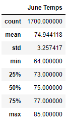
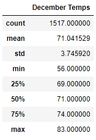

# Surfs Up

## Overview of Analysis
#### An analytical look at the data and viability behind a proposed year-round surf and ice cream shop in Oahu. Using Python, Pandas functions and methods, and SQLAlchemy, we can then generate summary statistics to compare June and December trends for comparison. 

## Results

### Summary Statistics of June Temperatures

- We had a sample size of 1700 temperatures.

- Of those 1700, the Average June temperature was 74.9 degrees. 

- In the whole data set, we observed the highest temperature of 85 degrees and the lowest of 64 degrees. 

### Summary Statistics of December Temperatures

- We had a sample size of 1517 temperatures.

- Of those 1517, the Average December temperature was 71 degrees. 

- In the whole data set, we observed the highest temperature of 83 degrees and the lowest of 56 degrees. 

## Summary
### I would not have predicted that the max and min temperatures between June and December would be so (relatively) close to each other. Using this data set I would expand the analysis to include more months to see the temperature change over the year and also precipitation / rainy days which could impact the surf / ice cream business.
